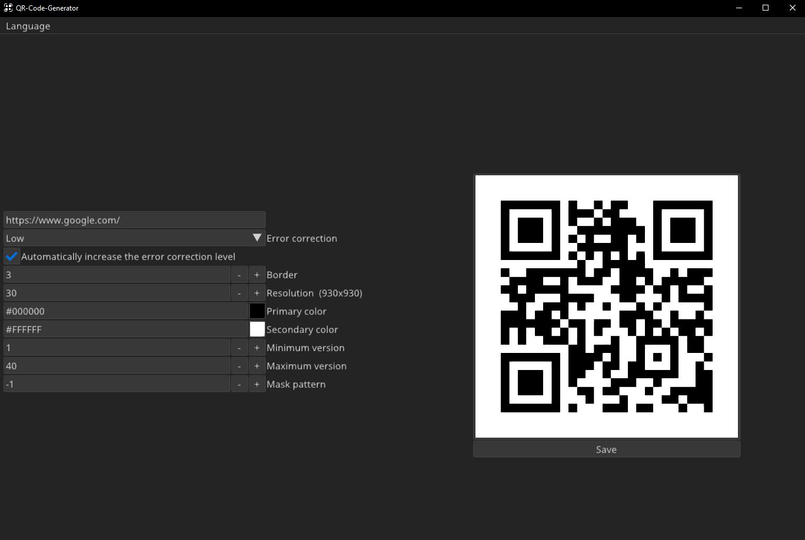

# QR-Generator
Generate QR codes with a good amount of customizability


# Build
## Prerequisites
### Windows and macOS
Nothing, everything is provided.
### Linux
The message boxes require `kdialog` or `xdialog` to be installed  
Following libraries have to be installed and accessible to the current user:
- xorg (should contain:)
  - libx11
  - libxcursor
  - libxrandr
  - libxinerama
  - libxi
- gtk-3
- gdk-3
- libpng
- glib-2
- libgobject-2.0

On some distros you have to make sure to install the developement `-dev` versions.

## Using premake
This is the prefered and only way if you want to have a visual studio project. The project uses premake as it's build system with the premake5 binaries already provided. I tested building with Visual Studio, Clang and GCC, but other compilers might work too, just give it a try.

For additional information use:

Windows
```
vendor\premake5.exe --help
```

Linux
```
vendor/premake5linux --help
```

macOS
```
vendor/premake5macos --help
```

## Clone

```
git clone https://github.com/cunterrainer/QR-Generator.git
```
```
cd QR-Generator
```

## Visual Studio

```
vendor\premake5.exe vs2022
```
This should generate a .sln file

## Make

Windows
```
vendor\premake5.exe gmake [cc]
```

Linux
```
vendor/premake5linux gmake [cc]
```

macOS
```
vendor/premake5macos gmake [cc]
```

GCC should be the default compiler on Windows and Linux, macOS uses Clang by default, but you can explicitly specify it if you want.  
GCC:   --cc=gcc  
Clang: --cc=clang  
There are also other compilers available however building has only been tested with gcc, clang and msvc

### Build

```
make [-j] config=<configuration>
```
Configurations:
 - debug_x86
 - debug_x64 (default, the same as just using `make`)
 - release_x86
 - release_x64

macOS:
 - debug_universal (default, the same as just using `make`)
 - release_universal

`-j` flag utilises multi-threaded compilation

```
make help
```
for additional information

## Using build script
If your just interested in building the project (without project files) you can use the provided script in `scripts\`. This script has to be executed from the main directory.
```
python scripts/build.py [cc]
```
Replace `[cc]` with either `gcc` or `clang` or leave it empty to build both
